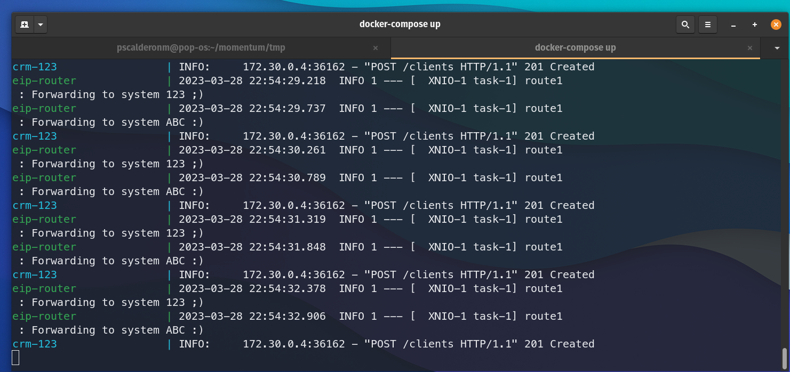

# What's included

- __workshop3-business-123-system__, third-party service developed on Python using FastAPI. It receives dataframes with buyingChannel=='digital'
- __workshop3-business-abc-system__, third-party service developed on NET Core using WebApi. It receives dataframes with buyingChannel=='digitalAndPos'
- __enterprise-integration-workshop3__, main process written using Spring Boot and Apache Camel that executes routing-related tasks of the incoming data to differents third-party providers. 
- __crm-emulator-sender__, a worker that generate incoming dataframes to the main process.

## Dataframe schema

```json
{
  "uid": 1,
  "names": "Herc Coles",
  "address": "4705 Sutteridge Avenue",
  "phone": "274-869-1991",
  "buyingChannel": "digitalAndPos"
}
```

# How to run

To build all workshop projects:
`docker-compose build`

To run the workshop:
`docker-compose up`, to see all generated logs from each component or add `-d` to decouple the execution

## If you run without docker

These environment variables must be specified for the main process to run successfully

- __SERVICE_SYSTEM123HOST__=localhost:8080
- __SERVICE_SYSTEMABCHOST__=localhost:5000

## To check functionality

- Access to `http://localhost:8081/swagger/index.html` for system ABC and to
`http://localhost:8082/docs` for system 123.
- Execute a GET call to /Clients endpoint to check loaded registers.

__Process running from terminal__


__Swagger from system ABC__


__Swagger from system 123__


## To clean up

> `docker-compose down`

